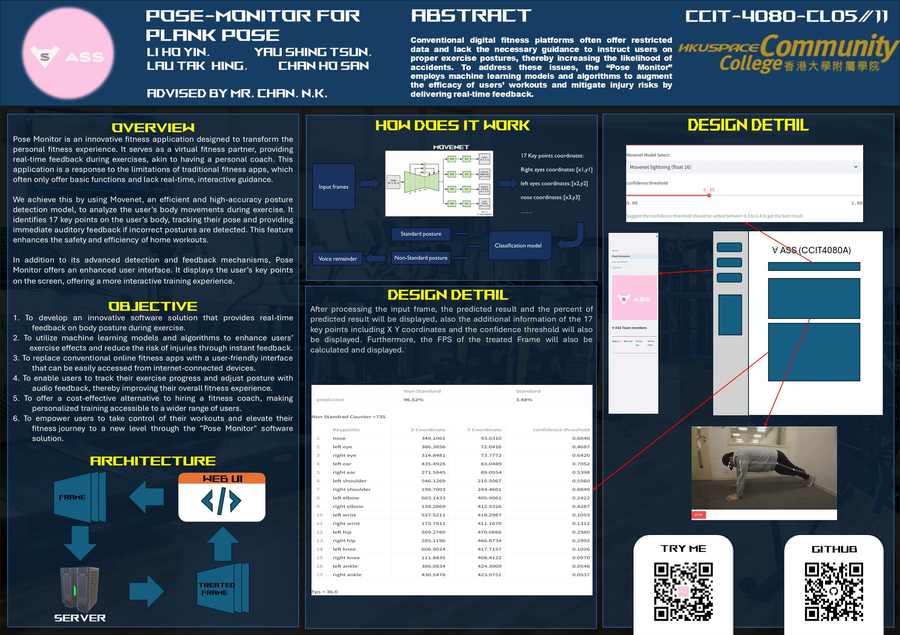

# Pose-Monitor
## Code structure
```shell
Pose-Monitor
├───.idea
├───CCIT4080A
| └───Home.py
| ├───ml
| | └───Add_html.py
| | └───Classifier.py
| | └───Draw_predict.py
| | └───Movenet.py
| | └───__init__.py
| | ├───__pycache__
| | | └───Add_html.cpython-311.pyc
| | | └───Classifier.cpython-311.pyc
| | | └───Draw_predict.cpython-311.pyc
| | | └───Movenet.cpython-311.pyc
| | | └───__init__.cpython-311.pyc
| ├───pages
| | └───1_Plank_Estimation.py
| | └───2_User_Guideline.py
| | └───9_Log_book.py
| ├───test
| | └───Standard1.jpg
| | └───Standard2.jpg
| | └───_NonStandard1.jpg
└───Error.mp3
└───For_ASS.jpeg
└───Missing_sound.mp3
└───Non_Standard_Sound1.mp3
└───Non_Standard_Sound2.mp3
└───Poster.jpg
└───README.md
└───Standard_Sound1.mp3
└───Standard_Sound2.mp3
└───Standard_Sound3.mp3
└───lite-model_movenet_singlepose_lightning_3.tflite
└───lite-model_movenet_singlepose_lightning_tflite_float16_4.tflite
└───lite-model_movenet_singlepose_lightning_tflite_int8_4.tflite
└───lite-model_movenet_singlepose_thunder_3.tflite
└───lite-model_movenet_singlepose_thunder_tflite_float16_4.tflite
└───lite-model_movenet_singlepose_thunder_tflite_int8_4.tflite
└───pose_classifier.tflite
└───pose_labels.txt
└───requirements.txt
└───test.py
└───user_guideline.mp4
| ├───plank_pose.zip
| | └───train
| | | └───standard
| | | └───non_standard
| | └───test
| | | └───standard
| | | └───non_standard
└───train_TFmodel.py
```
## Poster

## DEMO 
(https://pose-monitor.streamlit.app/)
## Normal User guideline


(https://youtu.be/Ilvtjpx4msE)
## For deploy in server or in computer
please download the .zip file and extract it.

### Install
please make sure to use pip install the following lirbaries into your Python IDE:
```shell
pip install Pyav, streamlit, streamlit-webrtc, opencv-python-headless, pandas, numpy, tensorflow
```

### Run
please get into the file 'CCIT4080A'

for window user, you can use this command:
```shell
cd CCIT4080A
```

than, you can use these command to run the program in the Python IDE
```shell
Streamlight run Home.py
```

### HTTPS

This program used this library "streamlit-webrtc"

refer to this [https://github.com/whitphx/streamlit-webrtc/tree/main]

`streamlit-webrtc` uses [`getUserMedia()`](https://developer.mozilla.org/en-US/docs/Web/API/MediaDevices/getUserMedia) API to access local media devices, and this method does not work in an insecure context.

[This document](https://developer.mozilla.org/en-US/docs/Web/API/MediaDevices/getUserMedia#privacy_and_security) says
> A secure context is, in short, a page loaded using HTTPS or the file:/// URL scheme, or a page loaded from localhost.

So, when hosting your app on a remote server, it must be served via HTTPS if your app is using webcam or microphone.
If not, you will encounter an error when starting using the device. For example, it's something like below on Chrome.
> Error: navigator.mediaDevices is undefined. It seems the current document is not loaded securely.

[Streamlit Community Cloud](https://streamlit.io/cloud) is a recommended way for HTTPS serving. You can easily deploy Streamlit apps with it, and most importantly for this topic, it serves the apps via HTTPS automatically by default.

For the development purpose, sometimes [`suyashkumar/ssl-proxy`](https://github.com/suyashkumar/ssl-proxy) is a convenient tool to serve your app via HTTPS.
```shell
$ streamlit run your_app.py  # Assume your app is running on http://localhost:8501
# Then, after downloading the binary from the GitHub page above to ./ssl-proxy,
$ ./ssl-proxy -from 0.0.0.0:8000 -to 127.0.0.1:8501  # Proxy the HTTP page from port 8501 to port 8000 via HTTPS
# Then access https://localhost:8000
```

## For self-training classification model in local environment

## Install
please make sure to use pip install the following lirbaries into your IDE:
```shell
pip install pandas, matplotlib, tensorflow, keras, scikit-learn, opencv-python, numpy
```
## prepare the file of the training data set
please replace the plank_pose.zip with your own training dataset

please make sure your training dataset is structured as follows
```shell
├───your_dataset.zip
| └───train
| | └───label_1
| | └───label_2
| └───test
| └───label_1
| └───label_2
```
